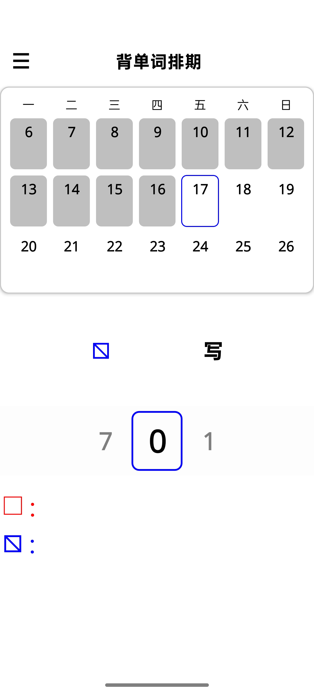
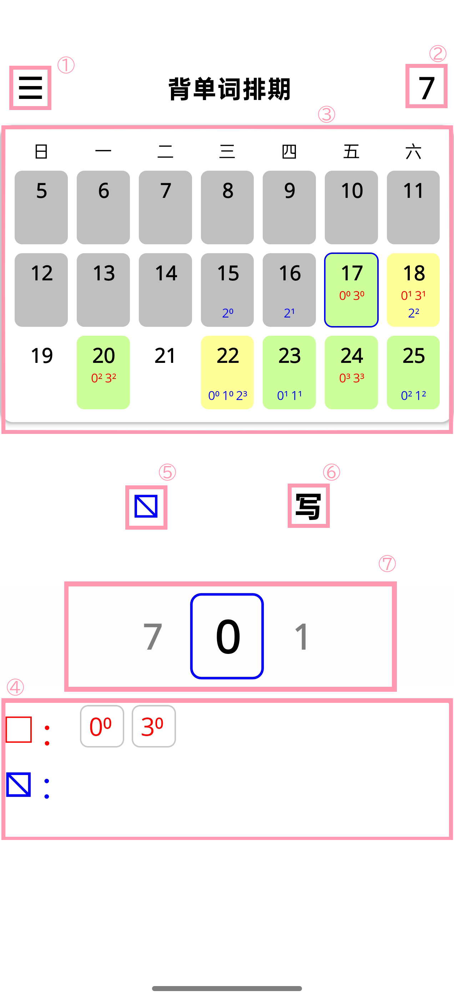

# memorize-words

An application of scheduling for memorizing vocabulary, using .NET MAUI

  

# 单词排期与记忆系统

# Vocabulary Scheduling & Memorization System

---

## 1. 单词分类

## 1. Word Classification

本系统将单词分为两类，以适应不同认知难度：
The system classifies vocabulary into two categories to match different cognitive challenges:

### (1) 完全陌生词

### (1) Completely Unknown Words

- 无法理解其含义  
- 无法通过读音或字形推测意义  

- Meaning is completely unknown  
- Cannot infer meaning from pronunciation or form  

### (2) 半熟词（音义脱节）  

### (2) Semi-Known Words (Phonology-Semantics Gap)

- 能通过汉字理解意义  
- 但无法通过读音直接联想到意义  

- Meaning can be inferred via written form (e.g., kanji)  
- But cannot be recalled from pronunciation alone  

两类单词分别记录在**不同笔记本**中。  
he two types are recorded in **separate notebooks**.

---

## 2. 确定当前要背的内容

## 2. How to Determine What to Study

单词来源与学习节奏如下：

Vocabulary source and learning flow:

-单词从单词书中提取  
-当积累满“一页笔记本”时，开始学习该页  

-Words are extracted from a vocabulary book  
-When enough words fill **one notebook page**, that page becomes active for study  

 “一页”是最基本学习单位。  
A “page” is the fundamental learning unit.

---

## 3. 单词轮转与复习规则

## 3. Rotation and Review Rules

采用基于记忆曲线的复习机制：
The system follows a spaced repetition model based on memory curves:

### (1) 学习后安排检测

### (1) Post-Study Review Scheduling

- 每一页在学习完成后，会设置若干检测日期  
- 检测时间依据记忆曲线安排  

- After studying a page, multiple review dates are scheduled  
- Timing follows spaced repetition principles  

### (2) 最多检测四次

### (2) Maximum of Four Reviews

- 每一页最多进行 **4 次检测**  

- Each page can be reviewed up to **4 times**

### (3) 错误标记机制

### (3) Error Marking System

- 每次检测中未掌握的单词，需要标记  
- 标记需能区分“第几次检测失败”  

- Words not remembered during a review must be marked  
- Marks must indicate **which attempt** failed  

示例 Example：

$$
\,^{0\,1}_{2\,3} \, 並木　なみき　街道两旁的树
$$

$$
\,^{0\,\,}_{\,\,3} \, 取り組み　とりくみ　致力于;主动处理
$$

### (4) 第四次仍失败的处理

### (4) Handling Words Failed After Fourth Review

- 若第四次仍未掌握,将该单词转移到**新的一页**,进入新的学习循环。

- If still not remembered after the 4th review, move the word to a **new page**. It enters a new learning cycle

---

## 4. App 与背单词系统的交互

## 4. Interaction Between App and Learning System

该 App 用于辅助管理整个流程，而不是替代记忆行为：
The app assists the workflow but does not replace the learning process:

### (1) 数据来源

### (1) Data Source

- 单词来自用户, App 不直接生成单词  
-- 如单词书，练习中不认识的词。
- Words come from the user, the app does not generate vocabulary  
--For example, vocabulary books and unfamiliar words in practice.

### (2) 学习驱动方式

### (2) Learning Workflow

- 用户手动记录单词到笔记本，或任何其他媒介
- App 记录页码、背诵起始的时间
  
- Users manually record words into a notebook or any other medium
- App records page numbers and the start time of memorization

### (3) 核心功能

### (3) Core Functions

- 记录某Ⅰ或Ⅱ类词页的学习起始时间  
- 自动在第0，1，3，7日测试的日程  
- 日程过多的日期将改变颜色以提示，方便错峰
- 可设置一目标日期，方便倒计时

- Record the starting time of learning a certain type I or II vocabulary page
- Automatically schedule testing on the 0th, 1st, 3rd, and 7th days
- Dates with too many schedules will change color to indicate for easy off peak scheduling
- Can set a target date for convenient countdown

### (4) 软件操作

### (4) App Operation

- ①处可更改日历排列
- ②处可设置一目标日期，方便倒计时
- ③处日历点击选择日期
- ④处以及③中日期下方显示当前选择的日期的所有日程
- 日程以 $页码^{次数}$ 的形式显示。按记忆曲线理论，四次复习需要8天日程。因此页码范围为0\~7,复习次数范围为0\~3。如：在17日加入页码为0的日程 $0^0$ ，则自动在18、20、24日也加入页码为0的日程 $0^1$ 、 $0^2$ 、 $0^3$ .
- 自动选择当日、Ⅱ类词为默认
- ⑤处点击切换Ⅰ/Ⅱ类词，切换词类会自动将⑦处轮盘设为切换后词类的前次输入页码的下一个页码
- ⑥处点击切换输入日程/删除日程模式
- ⑦处可通过左右滑动轮盘选择页码，默认为当前词类前次输入页码的下一个页码
- ④处显示当前选择日期的日程。在⑥处按钮为删除日程时，点击对应的日程，会将所在页码的一组日程全部删除。

- At ①, the calendar layout can be changed.
- At ②, a target date can be set for convenient countdown.
- At ③, a date can be selected by clicking on the calendar.
- At ④ and below the date at ③, all schedules for the currently selected date are displayed.
- Schedules are displayed in the form $page^{repetition}$. According to spaced repetition theory, four reviews require an 8-day schedule. Therefore, the page number ranges from 0 to 7, and the repetition count ranges from 0 to 3. For example: when a schedule with page 0 is added on the 17th as $0^0$, then schedules $0^1$, $0^2$, and $0^3$ for page 0 are automatically added on the 18th, 20th, and 24th as well.
- The current date and Type II words are selected by default.
- At ⑤, clicking toggles between Type I and Type II words. Switching word types automatically sets the wheel at ⑦ to the next page number after the last input page number for the switched-to word type.
- At ⑥, clicking toggles between add‑schedule mode and delete‑schedule mode.
- At ⑦, the page number can be selected by swiping the wheel left or right; the default is the next page number after the last input page number for the current word type.
- At ④, the schedules for the currently selected date are displayed. When the button at ⑥ is in delete‑schedule mode, clicking on a corresponding schedule deletes the entire set of schedules for that page number.

